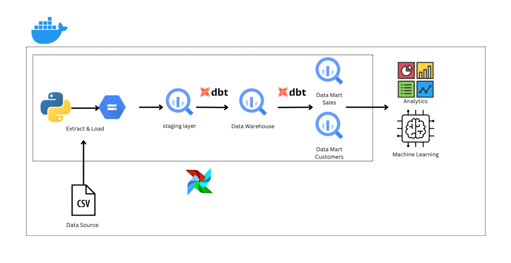

# Data Warehouse Project: Airflow + DBT + GCP

A comprehensive data pipeline leveraging Airflow, DBT, Google Cloud Platform (GCP), and Docker to extract, transform, and load data seamlessly from a staging layer to a data warehouse and data mart.

## Project Structure



## 🛠️ Project Overview
This project demonstrates an end-to-end implementation of a modern data stack:

1. Airflow: Orchestrates the data pipeline with DAGs.
2. DBT (Data Build Tool): Handles the transformation of data from the staging layer to the data warehouse and data mart.
3. GCP: Serves as the cloud platform for data storage and warehouse management.
4. Docker: Ensures all tools and dependencies are containerized for consistent development and deployment.

## ✨ Features

1. Automated Orchestration: Airflow DAGs schedule and automate tasks for data extraction, transformation, and loading.

2. Data Transformation with DBT:

Staging Layer: Raw data is cleaned and standardized.

Data Warehouse: Normalized data structure.

Data Mart: Denormalized data for easy reporting and analytics.

3. Cloud Integration: Leverages GCP's scalable infrastructure for efficient storage and querying.

4. Dockerized Environment: Simplifies setup and deployment across any environment.

## Setup

1. clone repo with ` git clone https://github.com/lixx21/airflow-dbt-gcp.git`
2. Setup your Google Cloud Platform
3. Create project in GCP and bucket in GCS and make sure your bucket location is in **US**
4. Get your credential key from GCP IAM (I would suggest you to store it inside [dags](./dags/) folder)
5. Fill the [.env](./dags/.env) file with your environment:

```
#.env

BUCKET_NAME = 
CREDENTIAL_KEY = 
GCP_CONN_ID= 
PROJECT_ID= 
```
6. Fill the [profiles.yml](./dags/dbt_transform/profiles.yml) with your credential's keyfile location in your local and your Project ID
```
dbt_transform:
  outputs:
    dev:
      dataset: shopping_data
      job_execution_timeout_seconds: 300
      job_retries: 1
      keyfile: {your keyfile location}
      location: US
      method: service-account
      priority: interactive
      project: {GCP project id}
      threads: 1
      type: bigquery
  target: dev
```
7. Create dataset named `shopping_data` in BigQuery and make sure your dataset in **US** location (because DBT only support US for now)
8. run the project using docker:

```
docker-compose up --build -d
```

## Reference

Setup DBT BigQuery

https://docs.getdbt.com/docs/core/connect-data-platform/bigquery-setup

https://medium.com/@perkasaid.rio/easiest-way-installing-dbt-for-bigquery-54d1c05f6dfe